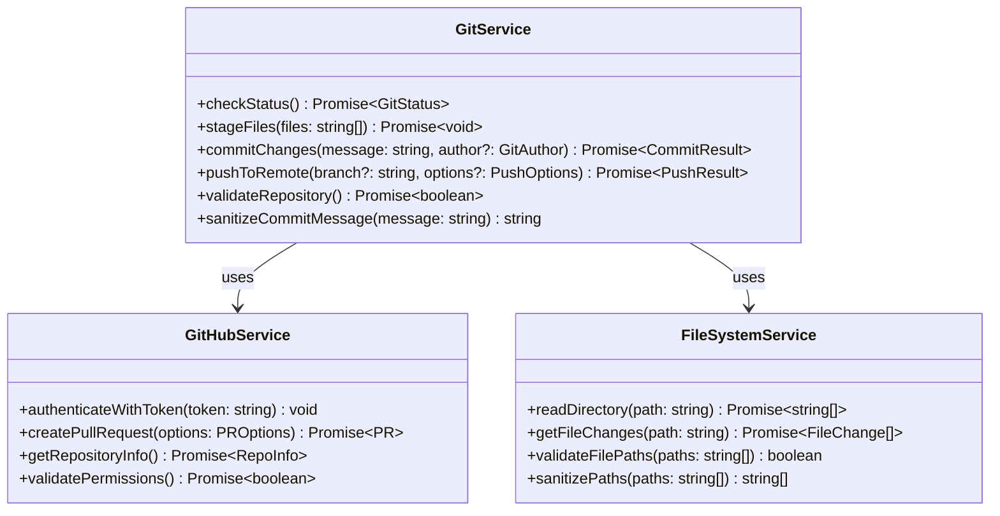
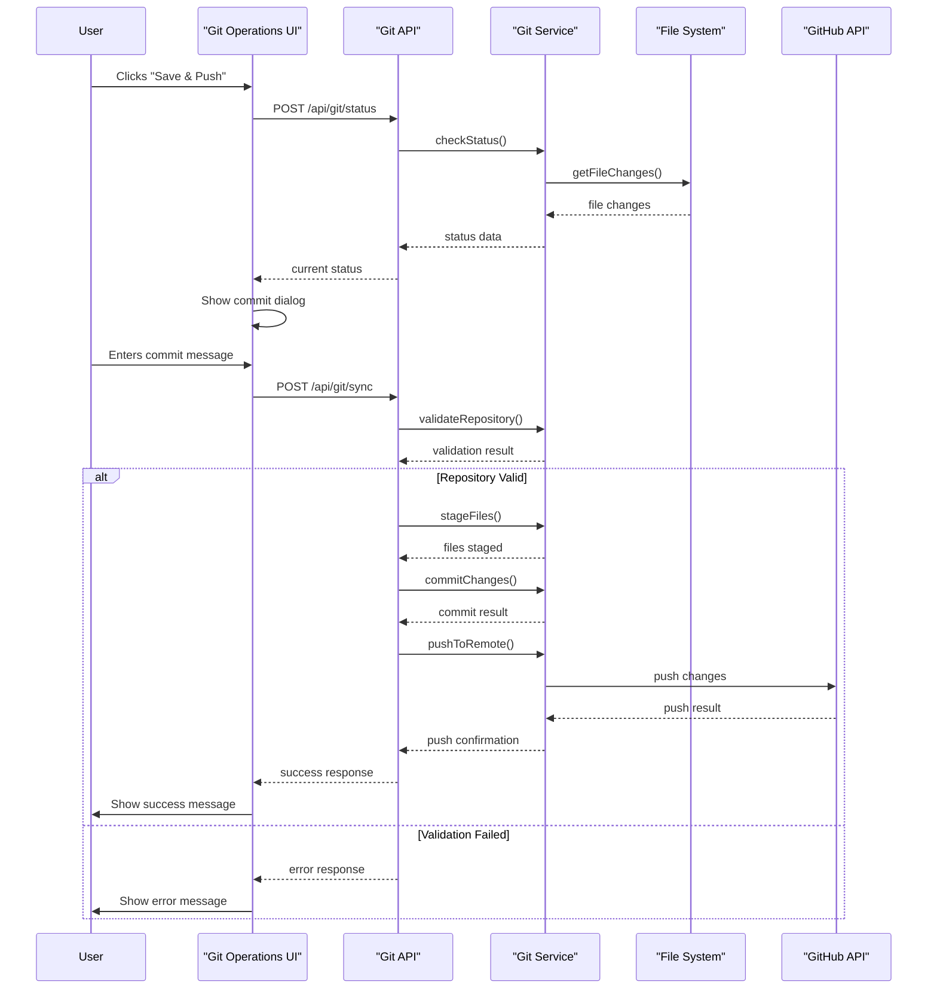
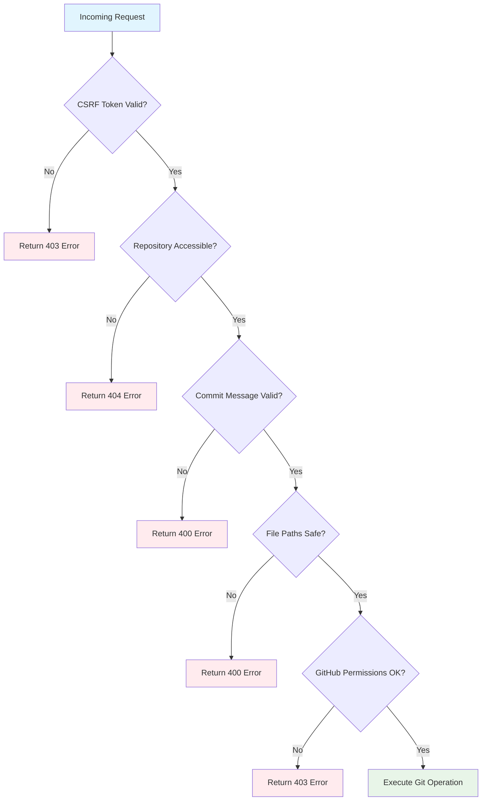
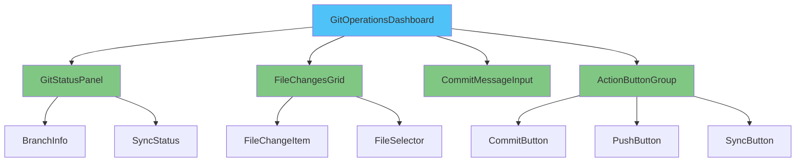
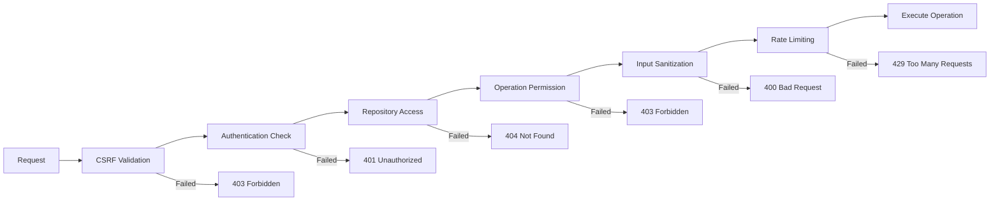
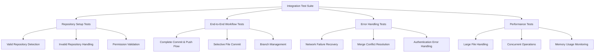

# Git Operations Integration Design

## Overview

This document outlines the design for implementing automated Git operations functionality within the Meridian Real Estate Platform. The feature will enable users to save changes, commit them with meaningful messages, and push to GitHub directly from the application interface, streamlining the development and deployment workflow.

## Technology Stack & Dependencies

### Core Technologies
- **Next.js 15.4.5** with App Router for API endpoints
- **Node.js 18+** runtime environment
- **TypeScript 5+** for type safety
- **Simple-git** library for Git operations
- **Octokit** for GitHub API integration

### New Dependencies Required
```json
{
  "dependencies": {
    "simple-git": "^3.20.0",
    "@octokit/rest": "^20.0.2",
    "minimatch": "^9.0.3"
  },
  "devDependencies": {
    "@types/minimatch": "^5.1.2"
  }
}
```

## Architecture Overview

The Git operations system follows the existing serverless microservices pattern, integrating seamlessly with the current API structure and dashboard system.

```mermaid
graph TB
    subgraph "Frontend Layer"
        A[Git Operations UI]
        B[Dashboard Integration]
        C[File Manager Component]
    end
    
    subgraph "API Layer"
        D[/api/git/status]
        E[/api/git/commit]
        F[/api/git/push]
        G[/api/git/sync]
    end
    
    subgraph "Service Layer"
        H[Git Service]
        I[GitHub Service]
        J[File System Service]
    end
    
    subgraph "External Services"
        K[GitHub API]
        L[Local Git Repository]
    end
    
    A --> D
    A --> E
    A --> F
    A --> G
    B --> A
    C --> A
    
    D --> H
    E --> H
    F --> I
    G --> H
    G --> I
    
    H --> L
    I --> K
    J --> L
```

## API Endpoints Reference

### 1. Git Status API
**Endpoint**: `POST /api/git/status`
**Purpose**: Retrieve current Git repository status including staged, unstaged, and untracked files

**Request Schema**:
```typescript
interface GitStatusRequest {
  path?: string; // Optional specific path to check
}
```

**Response Schema**:
```typescript
interface GitStatusResponse {
  success: boolean;
  data: {
    current: string; // Current branch name
    tracking: string; // Remote tracking branch
    ahead: number; // Commits ahead of remote
    behind: number; // Commits behind remote
    files: {
      staged: string[];
      modified: string[];
      not_added: string[];
      deleted: string[];
      renamed: Array<{ from: string; to: string }>;
    };
    clean: boolean;
  };
  timestamp: string;
}
```

### 2. Git Commit API
**Endpoint**: `POST /api/git/commit`
**Purpose**: Stage and commit changes with validation and security checks

**Request Schema**:
```typescript
interface GitCommitRequest {
  message: string; // Commit message (required)
  files?: string[]; // Specific files to commit (optional, commits all if empty)
  author?: {
    name: string;
    email: string;
  };
}
```

**Response Schema**:
```typescript
interface GitCommitResponse {
  success: boolean;
  data: {
    hash: string; // Commit SHA
    summary: {
      changes: number;
      insertions: number;
      deletions: number;
    };
  };
  message: string;
  timestamp: string;
}
```

### 3. Git Push API  
**Endpoint**: `POST /api/git/push`
**Purpose**: Push committed changes to remote GitHub repository

**Request Schema**:
```typescript
interface GitPushRequest {
  branch?: string; // Target branch (defaults to current)
  force?: boolean; // Force push flag (default: false)
}
```

**Response Schema**:
```typescript
interface GitPushResponse {
  success: boolean;
  data: {
    branch: string;
    remote: string;
    pushed: number; // Number of commits pushed
  };
  message: string;
  timestamp: string;
}
```

### 4. Git Sync API
**Endpoint**: `POST /api/git/sync`
**Purpose**: Complete workflow - commit and push in one operation

**Request Schema**:
```typescript
interface GitSyncRequest {
  message: string; // Commit message
  files?: string[]; // Files to include
  pushAfterCommit?: boolean; // Auto-push after commit (default: true)
}
```

## Data Models & Services

### Git Service Layer



### Core Data Models

```typescript
interface GitStatus {
  current: string;
  tracking: string;
  ahead: number;
  behind: number;
  files: GitFiles;
  clean: boolean;
}

interface GitFiles {
  staged: string[];
  modified: string[];
  not_added: string[];
  deleted: string[];
  renamed: Array<{ from: string; to: string }>;
}

interface CommitResult {
  hash: string;
  summary: {
    changes: number;
    insertions: number;
    deletions: number;
  };
}

interface PushResult {
  branch: string;
  remote: string;
  pushed: number;
}
```

## Business Logic Layer

### Git Operations Workflow



### Validation & Security Layer



## Component Architecture

### Git Operations Dashboard Component

```typescript
interface GitOperationsProps {
  repositoryPath: string;
  userPermissions: UserPermissions;
  onOperationComplete: (result: GitOperationResult) => void;
}

interface GitOperationsState {
  status: GitStatus | null;
  isLoading: boolean;
  selectedFiles: string[];
  commitMessage: string;
  error: string | null;
}
```

### Component Hierarchy



### Props & State Management

```typescript
// Main component props interface
interface GitOperationsComponentProps {
  className?: string;
  repositoryPath?: string;
  autoSync?: boolean;
  onSuccess?: (operation: string, result: any) => void;
  onError?: (operation: string, error: Error) => void;
}

// Component state management
interface GitOperationsState {
  repository: {
    status: GitStatus | null;
    isValid: boolean;
    lastSync: Date | null;
  };
  ui: {
    isLoading: boolean;
    activeOperation: 'status' | 'commit' | 'push' | 'sync' | null;
    showCommitDialog: boolean;
    selectedFiles: Set<string>;
  };
  form: {
    commitMessage: string;
    authorName: string;
    authorEmail: string;
  };
  errors: {
    repository?: string;
    commit?: string;
    push?: string;
    network?: string;
  };
}
```

## Middleware & Security

### Authentication Requirements

```typescript
interface GitOperationsAuth {
  // Repository access validation
  validateRepositoryAccess(path: string, userId: string): Promise<boolean>;
  
  // GitHub token validation
  validateGitHubToken(token: string): Promise<boolean>;
  
  // Operation permissions
  checkOperationPermission(
    userId: string, 
    operation: GitOperation, 
    repository: string
  ): Promise<boolean>;
}
```

### Security Middleware Chain



### Input Validation Rules

```typescript
const GitOperationValidation = {
  commitMessage: {
    minLength: 10,
    maxLength: 500,
    pattern: /^[a-zA-Z0-9\s\-_.,!?()[\]{}'"]+$/,
    blacklist: ['password', 'secret', 'token', 'key']
  },
  
  filePaths: {
    allowedExtensions: ['.ts', '.tsx', '.js', '.jsx', '.json', '.md', '.css'],
    blockedPaths: ['.env', '.env.local', 'node_modules/', '.git/'],
    maxFiles: 50
  },
  
  branchName: {
    pattern: /^[a-zA-Z0-9\-_/]+$/,
    maxLength: 100,
    reserved: ['HEAD', 'master', 'main']
  }
};
```

## Testing Strategy

### Unit Testing Structure

```typescript
describe('Git Operations API', () => {
  describe('/api/git/status', () => {
    it('should return repository status for valid requests');
    it('should handle repository not found errors');
    it('should validate CSRF tokens');
    it('should sanitize file paths in response');
  });

  describe('/api/git/commit', () => {
    it('should commit valid changes');
    it('should validate commit message format');
    it('should handle merge conflicts');
    it('should prevent commits to protected branches');
  });

  describe('/api/git/push', () => {
    it('should push to remote successfully');
    it('should handle authentication failures');
    it('should prevent force pushes without permission');
    it('should handle network timeouts gracefully');
  });
});
```

### Integration Testing Scenarios




