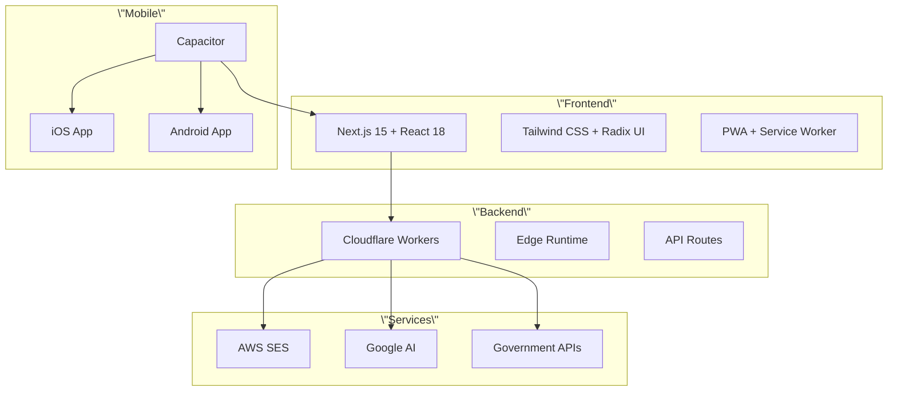

# Meridian Real Estate Platform - Production Deployment Guide

<div align=\"center\">
  <h1>🏖️ Meridian República Dominicana</h1>
  <p><strong>The #1 Luxury Real Estate Investment Platform</strong></p>
  <p>TikTok-style property browsing with gamified ROI calculations</p>
  
  [](https://deploy.workers.cloudflare.com/?url=https://github.com/your-repo/meridian-app)
  [](https://vercel.com/new/clone?repository-url=https://github.com/your-repo/meridian-app)
</div>


## 🚀 Quick Start

### Web Deployment (Cloudflare Workers)

```bash
# Clone and setup
git clone https://github.com/your-repo/meridian-app.git
cd meridian-app
npm install

# Deploy to web
./deploy.sh web
```

### Mobile App Deployment

```bash
# Build for mobile app stores
./deploy.sh mobile

# iOS only (requires macOS)
./deploy.sh ios

# Android only
./deploy.sh android
```

## 📱 Platform Support

| Platform | Status | Store |
|----------|--------|---------|
| 🌐 **Web PWA** | ✅ Production Ready | [Cloudflare Workers](https://workers.cloudflare.com) |
| 📱 **iOS App** | ✅ App Store Ready | [Apple App Store](https://apps.apple.com) |
| 🤖 **Android App** | ✅ Play Store Ready | [Google Play Store](https://play.google.com) |

## 🏗️ Architecture Overview



## 🛠️ Technology Stack

### Core Framework
- **Next.js 15** - App Router with Server Components
- **React 18** - Component-based UI with concurrent features
- **TypeScript** - Type-safe development
- **Tailwind CSS** - Utility-first styling

### Mobile & PWA
- **Capacitor** - Cross-platform mobile development
- **PWA** - Progressive Web App capabilities
- **Service Workers** - Offline functionality and caching

### Deployment & Infrastructure
- **Cloudflare Workers** - Edge computing platform
- **Vercel** - Alternative deployment option
- **AWS SES** - Transactional email service
- **Google AI** - AI-powered chat assistance

## 📋 Prerequisites

### Development Environment
- **Node.js** 18+ ([Download](https://nodejs.org/))
- **npm** 9+ (comes with Node.js)
- **Git** ([Download](https://git-scm.com/))

### Mobile Development (Optional)
- **iOS Development**:
  - macOS 12+
  - Xcode 14+
  - iOS Simulator
  - Apple Developer Account

- **Android Development**:
  - Android Studio
  - Android SDK 24+
  - Java 11+
  - Google Play Console Account

### Cloud Services
- **Cloudflare Account** ([Sign up](https://dash.cloudflare.com/sign-up))
- **AWS Account** for SES ([Sign up](https://aws.amazon.com/))
- **Google Cloud Account** for AI APIs ([Sign up](https://cloud.google.com/))

## ⚙️ Environment Configuration

### 1. Clone and Install
```bash
git clone https://github.com/your-repo/meridian-app.git
cd meridian-app
npm install
```

### 2. Environment Variables
Create `.env.local` for development:
```bash
cp .env.example .env.local
# Edit .env.local with your configuration
```

**Required Environment Variables:**
```bash
# Application
NEXT_PUBLIC_APP_URL=https://your-domain.com
NODE_ENV=production

# AWS SES
AWS_ACCESS_KEY_ID=your_aws_access_key
AWS_SECRET_ACCESS_KEY=your_aws_secret_key
EMAIL_REGION=us-east-1
EMAIL_FROM=noreply@your-domain.com

# Google AI
GOOGLE_AI_API_KEY=your_google_ai_key

# Security
SECRET_KEY=your_secret_key
JWT_SECRET=your_jwt_secret
```

### 3. Configure Services

#### AWS SES Setup
```bash
# Install AWS CLI
curl \"https://awscli.amazonaws.com/AWSCLIV2.pkg\" -o \"AWSCLIV2.pkg\"
sudo installer -pkg AWSCLIV2.pkg -target /

# Configure AWS
aws configure
# Enter your AWS Access Key ID, Secret, and Region

# Verify SES domain (replace with your domain)
aws ses verify-domain-identity --domain your-domain.com
```

#### Google AI Setup
```bash
# 1. Go to Google Cloud Console
# 2. Enable Generative AI API
# 3. Create API key
# 4. Add to environment variables
```

## 🌐 Web Deployment

### Cloudflare Workers (Recommended)

1. **Install Wrangler CLI**
```bash
npm install -g wrangler
wrangler login
```

2. **Configure wrangler.toml**
```toml
name = \"meridian-real-estate\"
compatibility_date = \"2024-01-01\"

[env.production]
name = \"meridian-real-estate-prod\"
routes = [
  { pattern = \"your-domain.com/*\", zone_name = \"your-domain.com\" }
]
```

3. **Set Secrets**
```bash
wrangler secret put AWS_ACCESS_KEY_ID
wrangler secret put AWS_SECRET_ACCESS_KEY
wrangler secret put GOOGLE_AI_API_KEY
wrangler secret put SECRET_KEY
```

4. **Deploy**
```bash
./deploy.sh web
```

### Alternative: Vercel Deployment

```bash
# Install Vercel CLI
npm install -g vercel

# Deploy
vercel --prod
```

## 📱 Mobile App Deployment

### iOS App Store

1. **Prerequisites**
   - macOS with Xcode 14+
   - Apple Developer Account ($99/year)
   - App Store Connect access

2. **Build iOS App**
```bash
./deploy.sh ios
```

3. **Configure in Xcode**
   - Open `ios/App/App.xcworkspace`
   - Set Bundle Identifier: `com.meridian.rd`
   - Configure signing certificates
   - Set deployment target: iOS 13.0+

4. **Submit to App Store**
   - Archive the app in Xcode
   - Upload to App Store Connect
   - Fill in metadata (use `app-store-metadata.md`)
   - Submit for review

### Google Play Store

1. **Prerequisites**
   - Android Studio
   - Google Play Console Account ($25 one-time)
   - Signed APK/AAB

2. **Build Android App**
```bash
./deploy.sh android
```

3. **Configure in Android Studio**
   - Open `android/` directory
   - Update `applicationId` in `build.gradle`
   - Configure signing keys
   - Set minimum SDK: 24 (Android 7.0)

4. **Generate Release Build**
```bash
cd android
./gradlew bundleRelease
```

5. **Upload to Play Store**
   - Go to Google Play Console
   - Create new app
   - Upload AAB file (`android/app/build/outputs/bundle/release/`)
   - Fill in store listing (use `play-store-metadata.md`)
   - Submit for review

## 🔒 Security & Performance

### Security Features
- ✅ HTTPS everywhere
- ✅ Security headers (CSP, HSTS, etc.)
- ✅ Input validation and sanitization
- ✅ Rate limiting
- ✅ Environment variable protection
- ✅ CORS configuration

### Performance Optimizations
- ✅ Static site generation
- ✅ Image optimization (WebP, AVIF)
- ✅ Code splitting and lazy loading
- ✅ Service worker caching
- ✅ Edge computing (Cloudflare Workers)
- ✅ Bundle size optimization

### Run Performance Audit
```bash
node scripts/optimize-performance.js
npm run lighthouse
npm audit
```

## 🧪 Testing & Quality Assurance

### Development Testing
```bash
# Start development server
npm run dev

# Run linting
npm run lint

# Run type checking
npm run type-check

# Run security audit
npm audit
```

### Mobile Testing
```bash
# iOS Simulator
npm run mobile:run:ios

# Android Emulator
npm run mobile:run:android

# Live reload for mobile
npm run mobile:live-reload
```

### Production Testing
```bash
# Build and test production bundle
npm run build
npm run start

# Test mobile build
npm run build:mobile
```

## 📊 Monitoring & Analytics

### Key Metrics
- **Performance**: Core Web Vitals, Page Load Times
- **User Experience**: Bounce Rate, Session Duration
- **Business**: Conversion Rate, User Engagement
- **Technical**: Error Rates, API Response Times

### Monitoring Setup
1. **Google Analytics 4** - User behavior tracking
2. **Sentry** - Error monitoring and performance
3. **Cloudflare Analytics** - CDN and security metrics
4. **Lighthouse CI** - Automated performance testing

## 🚨 Troubleshooting

### Common Issues

#### Build Errors
```bash
# Clear cache and reinstall
rm -rf .next node_modules package-lock.json
npm install
npm run build
```

#### Mobile Build Issues
```bash
# Sync Capacitor
npx cap sync

# Clean mobile builds
npx cap clean
npx cap sync
```

#### Environment Variables
```bash
# Check environment variables
echo $NODE_ENV
echo $NEXT_PUBLIC_APP_URL

# Verify .env files
cat .env.local
```

### Support Channels
- 📧 **Email**: support@meridian-rd.com
- 💬 **Discord**: [Join our community](https://discord.gg/meridian)
- 📖 **Documentation**: [Full docs](https://docs.meridian-rd.com)
- 🐛 **Issues**: [GitHub Issues](https://github.com/your-repo/meridian-app/issues)

## 📄 License & Legal

### License
This project is licensed under the MIT License - see the [LICENSE](LICENSE) file for details.

### Compliance
- ✅ GDPR compliant
- ✅ CCPA compliant
- ✅ App Store guidelines
- ✅ Play Store policies
- ✅ Accessibility standards (WCAG 2.1)

### Privacy & Terms
- [Privacy Policy](https://meridian-rd.com/privacy)
- [Terms of Service](https://meridian-rd.com/terms)
- [Cookie Policy](https://meridian-rd.com/cookies)

---

<div align=\"center\">
  <p><strong>Built with ❤️ for luxury real estate investors</strong></p>
  <p>© 2024 Meridian Real Estate. All rights reserved.</p>
</div>"